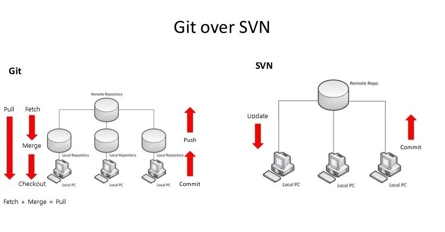
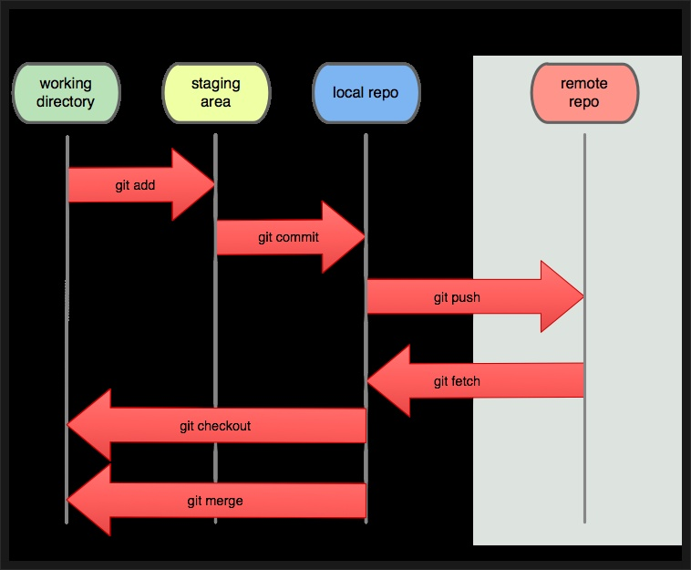
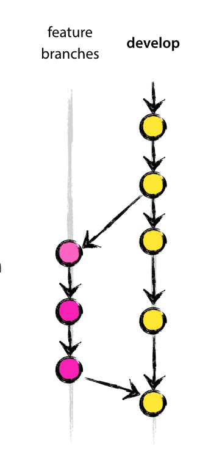
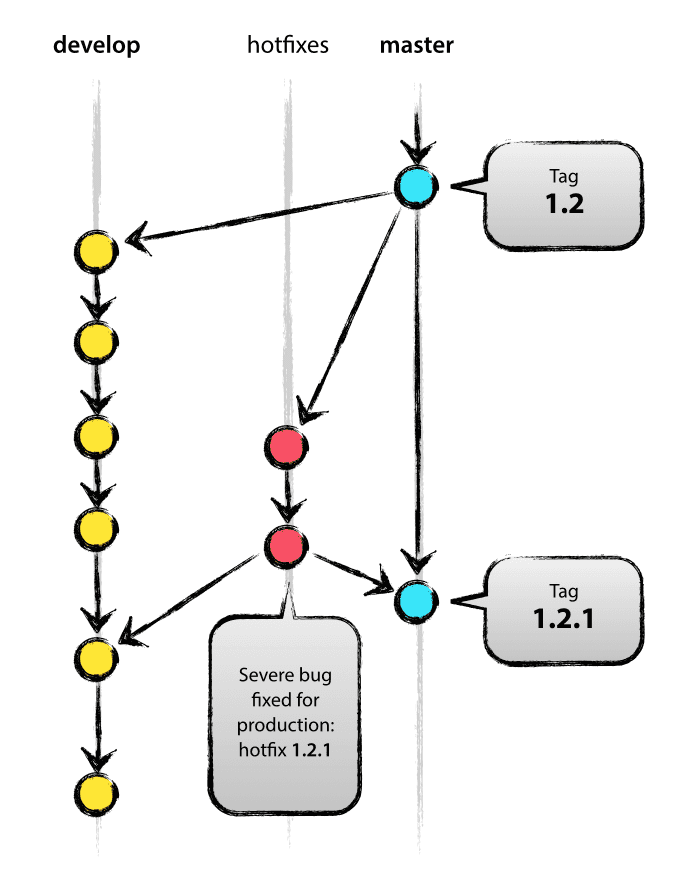

# Git,Git-Flow

> **목차**
> 
> - [Git이란?]()
>     - [SVN과 Git의 차이점]()
>     - [Git의 장점]()
>     - [Git의 단점]()
>     - [작업 흐름 및 관련 용어]()
> - [Git-Flow란?]()
>     - [주요 branch]()
>     - [메인 branch]()
>     - [보조 branch]()

# 💡Git이란?

- 형상 관리 도구(Configuration Management Tool)
- 소프트웨어를 개발하는 기업의 핵심 자산인 소스코드를 효과적으로 관리할 수 있게 해주는 무료 공개 소프트웨어

> **SVN과 Git의 차이점**
> 

- SVN 은 내 로컬PC 에서 Commit을 하면 바로 중앙저장소에 반영이 되는 중앙집중형 방식
- Git 은 내 로컬PC에서 Commit을 하면 로컬 저장소에 반영이 되고 로컬저장소에서 Push를 하면

원격저장소에 반영이 되는 분산 관리 방식

- **GIT을 사용하는 이유?**
    - 하나의 파일에 대해서 작업자 별로 각기 다른 작업을 할 수 있고, 각 이력을 별도로 관리할 수 있음
    - 개발시 처리속도가 svn보다 빠름

> **Git의 장점**
> 
- 분산 버전 관리이기 때문에 인터넷이 연결되지 않은 곳에서도 개발을 진행할 수 있음
- 중앙 서버에 장애가 발생해도 로컬 저장소에 커밋을 할 수 있으며, 로컬 저장소에 각자 이력을 받아서 관리하고 있으므로 중앙 저장소의 복원도 가능함

> **Git의 단점**
> 
- 개념을 이해하기까지 학습의 시간이 필요→협업 중 Git 이해도가 낮으면 이슈가 발생할 수 있음
- 중앙집중형 방식보다는 덜 직관적임

> **작업 흐름 및 관련 용어**
> 

- 기본 용어
    - **Repository** : 저장소를 의미하며, 저장소는 히스토리, 태그, 소스의 가지치기 혹은 branch에 따라 버전을 저장함. 저장소를 통해 작업자가 변경한 모든 히스토리를 확인 할 수 있음
        - local repository : 내 pc에 파일이 저장되는 개인 저장소
        - remote repository : 원격저장소(여러사람이 함께 공유하는 저장소)
    - **Working Directory** : 어느 한 시점을 바라보는 작업자의 현재 시점
    - **Staging Area** : 저장소에 커밋하기 전에 커밋을 준비하는 위치. git add 변경 내용이 Git저장소에 기록되기 전에 대기하는 장소
    - **Commit** : 현재 변경된 작업 상태를 점검을 마치면 확정하고 저장소에 저장하는 작업
    - **Head** : 현재 작업중인 Branch를 가리킴
    - **Branch** : 가지 또는 분기점을 의미하며, 작업을 할 때에 현재 상태를 복사하여 Branch에서 작업을 한 후에 완전하다 싶을때 Merge를 하여 작업함
    - **Merge** : 다른 Branch의 내용을 현재 Branch로 가져와 합치는 작업을 의미
- 영역별 상태
    - **Modified** : 수정한 파일을 아직 로컬 저장소에 커밋하지 않은 것을 의미
    - **Staged** : 현재 수정한 파일을 곧 커밋할 것이라고 표시한 상태를 의미
    - **Committed** : 데이터가 로컬 데이터베이스에 안전하게 저장됐다는 것을 의미
- 주요 명령어
    - **git init** : 깃 저장소를 초기화. 저장소나 디렉토리 안에서 이 명령을 실행하기 전까지는 그냥 일반 폴더. 이것을 입력한 후에야 추가적인 깃 명령어들을 줄 수 있음
    - **git add** : 작업 디렉토리(working directory) 상의 변경 내용을 스테이징 영역(staging area)에 추가하기 위해서 사용
    - **git commit** : 깃의 의미있는 수정 작업이 끝났을 때 마침을 알리는 작업
    - **git push** : 로컬 저장소에서 남겨놓은 코드 변경 이력들이 원격 저장소로 전송됨
    - **git checkout** : 독립된 작업 공간인 브랜치를 자유롭게 이동할 수 있음
    - **git branch** :여러 협업자와 작업하고 자신만의 변경을 원한다면 이 명령어로 새로운 브랜치를 만들고, 독립적인 공간을 만듦.
    - **git merge** : 원격저장소에 있는 변경사항들을 현재 브랜치에 병합
    - **git fetch** : 원격저장소에 있는 변경사항들을 로컬저장소에 가져오기 전에 변경내용을 확인하고 싶은 경우에 사용하는 명령어(변경내용을 로컬에 영향을 미치지 않음)
    - **git pull** : 로컬 컴퓨터에서 작업할 때, 저장소의 변경된 내용을 로컬(내 컴퓨터) 저장소에 적용하는 작업
    - **git status** : 이전 커밋과 비교해서 변경 내용을 표시

# 💡Git-Flow란?

- git을 통해 효율적으로 프로젝트를 관리하고 배포하기 위한 전략
- 규모가 큰 프로젝트 배포를 중점으로 브랜치 관리를 엄격하게 하는 모델

> **주요 branch**
> 

- **master** : 정식으로 배포되는 안정적인 버전의 소스코드가 관리됨. master 브랜치는 제품으로 출시할 수 있을만큼 안정성이 충분히 검증된 코드들만이 병합되어야 함
- **develop** : 다음 버전을 개발하는 브랜치로, 소스코드들이 끊임없이 추가됨. 버그들을 수정하기 위한 코드와 새로운 기능을 추가하기 위한 코드, 성능 개선하기 위한 코드들이 검증이 완료되고 PR(Pull Request)요청을 거치게 되면 develop branch로 병합함
- **feature** : 단위별로 기능을 개발하는 브랜치로 완료되면 develop 브랜치와 병합함
- **release** : 배포 전 QA(품질검사)를 통해 버그를 찾아내는 브랜치로 develop에서 master로 병합되기전에 테스팅을 위한 브랜치
- **hotfix** : master 브랜치에서 발생한 버그를 긴급하게 수정하는 브랜치

> **메인 branch**
> 
- 항상 유지되는 메인 브랜치

- **master branch** :  항상 프로덕션 레벨로 유지
- **develop branch** : 항상 다음 리스트에 대한 최신 개발 변경 사항을 제공
- develop branch의 소스코드가 안정적인 지점에 도달하고 release할 준비가 되면 모든 변경사항을 master에 병합한 다음 release 번호로 태그를 지정

> **보조 branch**
> 
- 필요에 의해서 운영하는 브랜치
- 일정 기간 동안만 유지되는 보조 브랜치

- **feature branch**
    - 새로운 기능 개발이나 버그 수정을 위한 일련의 코드 수정이 이루어지는 브랜치
    - 기능단위로 개발이 되며, 기능이 개발될 경우 develop으로 병합되거나, 폐기
    - develop branch에서 분기해서 다시 develop branch 로 다시 병합

- **release branch**
    - 배포 전 QA(품질검사)를 통해 버그를 찾아내는 브랜치
    - develop branch에서 분기 후 develop branch와 master branch에 병합
    - 병합 후 release branch가 필요하지 않다 생각되면 삭제

- **hotfix branch**
    - master branch에서 분기
    
       → master 프로덕션 레벨에서 발생된 버그를 빨리 수정해야하기 때문
    
    - 수정된 버그를 반영할 때는 master와 develop branch에 동시에 해줘야함
    
       → master branch에 반영된 정보를 develop branch도 알아야 하기 때문
    
    - develop branch가 수정되는동안 hotfix branch를 통해 버그를 고치고 master와 develop에 빠르게 반영을 시킬 수 있음

- 예시
    1. 일단 **master** 브랜치에서 시작
    2. 동일한 브랜치를 **develop**에도 생성. 개발자들은 이 develop 브랜치에서 개발을 진행
    3. 개발을 진행하다가 회원가입, 장바구니 등의 기능 구현이 필요할 경우
    
        → A개발자는 develop 브랜치에서 **feature** 브랜치를 하나 생성해서 회원가입 기능을 구현하고
    
        → B개발자도 develop 브랜치에서 **feature** 브랜치를 하나 생성해서 장바구니 기능을 구현
    
    1. 완료된 feature 브랜치는 검토를 거쳐 다시 **develop** 브랜치에 합침(Merge)
    2. 이제 모든 기능이 완료되면 develop 브랜치를 **release** 브랜치로 만듦. 그리고 QA(품질검사)를 하면서 보완점을 보완하고 버그를 픽스
    3. 모든 것이 완료되면 이제 release 브랜치를 **master** 브랜치와 **develop** 브랜치로 보냄. **master** 브랜치에서 버전추가를 위해 태그를 하나 생성하고 배포
    4. 배포를 했는데 미처 발견하지 못한 버그가 있을 경우 **hotfix** 브랜치를 만들어 긴급 수정 후 태그를 생성하고 바로 수정 배포